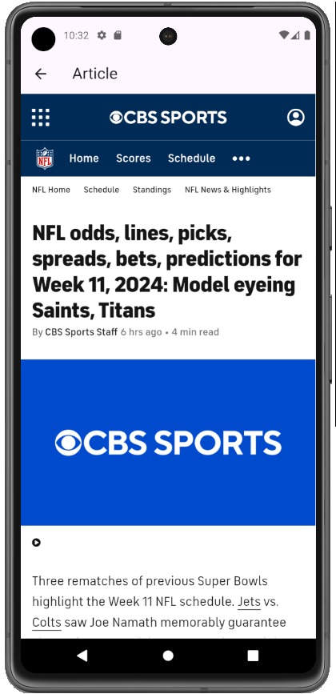

# News App

A Flutter-based news application that fetches and displays the latest headlines from various categories using the [NewsAPI](https://newsapi.org/). Users can browse articles by category, view article summaries, and open full articles in an integrated WebView for a seamless reading experience.

## Table of Contents

- [Features](#features)
- [Demo](#demo)
- [Setup](#setup)
- [Configuration](#configuration)
- [Project Structure](#project-structure)
- [Dependencies](#dependencies)

## Features

- **Category Selection**: Users can select from various categories such as Sports, Technology, Science, Business, Health, Entertainment, and General.
- **Top Headlines**: Fetches and displays top headlines from NewsAPI for selected categories.
- **Article Details**: View a brief summary of each article including title, image, and description.
- **In-App WebView**: Opens full article within the app using WebView, maintaining a seamless reading experience.
- **Responsive Design**: Optimized for both iOS and Android devices.

## Demo
Here’s a preview of the News App in action:

<p align="center">
  
  
   
</p>

### Video/GIF Demo
Watch the app in action:


## Setup

1. **Clone the repository**
   ```bash
   git clone https://github.com/NadaAlaa1/news-app.git
   cd news-app
   
2. **Install dependencies**
   
   Make sure you have Flutter installed. Then, run the following command to install the required packages:
   ```bash
   flutter pub get

4. **Obtain NewsAPI Key**

   - Go to [NewsAPI](https://newsapi.org/) and sign up to obtain a free API key.
   - Copy the API key.
     
5. **Add the API Key**

   Replace `YOUR_API_KEY_HERE` in the `NewsService` class with your actual NewsAPI key to enable the app to fetch news articles. 
   
   Open `NewsService` and update the following line:
   
   ```dart
   var response = await dio.get(
     'https://newsapi.org/v2/top-headlines?apiKey=YOUR_API_KEY_HERE&country=us&category=$category'
   );

6. **Platform-Specific Configuration**

   - **Android**: Add internet permission in `android/app/src/main/AndroidManifest.xml`:
     ```xml
     <uses-permission android:name="android.permission.INTERNET"/>

   - **iOS**: Add the following entry to `ios/Runner/Info.plist` to enable WebView loading:
     ```xml
     <key>NSAppTransportSecurity</key>
     <dict>
        <key>NSAllowsArbitraryLoads</key>
        <true/>
     </dict>

7. **Run the App**
   ```bash
   flutter run

## Configuration

- **API**: This app uses [NewsAPI](https://newsapi.org/) to fetch news articles.
- **WebView**: Implemented using `webview_flutter` to render full article pages.
  
## Project Structure

Here’s a brief overview of the key folders and files in this project:
- **lib/main.dart**: Entry point of the application.
- **lib/models**: Contains data models, such as `ArticleModel` and `CategoryModel`.
- **lib/services**: Handles network requests using `Dio` for fetching news data.
- **lib/views**: Holds screens like `HomeView`, `CategoryView`, and `ArticleWebView`.
- **lib/widgets**: Contains reusable widgets, such as `CategoryCard`, `NewsTile`, `NewsListView`.
  
## Dependencies

- **flutter**: The main framework for building the application.
- **dio**: A powerful HTTP client for Dart, used for making API requests.
- **webview_flutter**: Enables in-app web browsing to open full news articles.
- **cached_network_image**: Provides image caching and loading for optimized performance.

Install these dependencies by running:
```bash
flutter pub get
